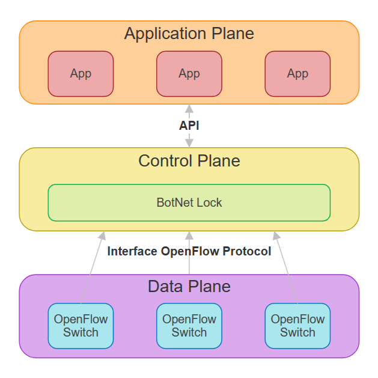
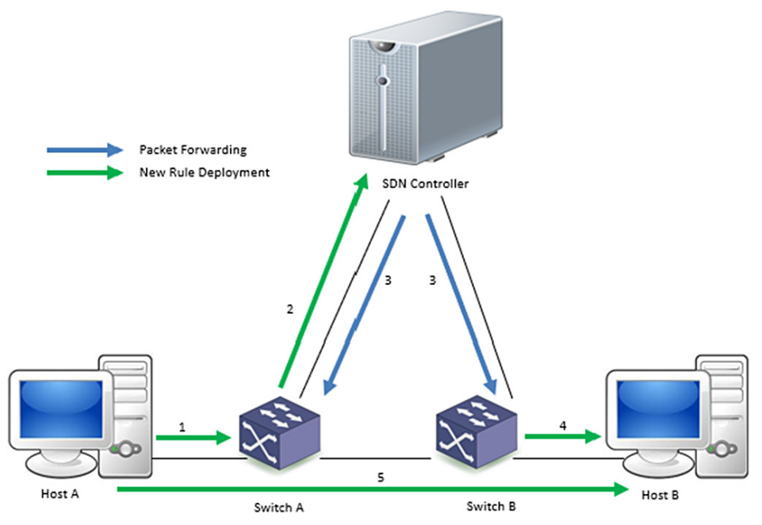
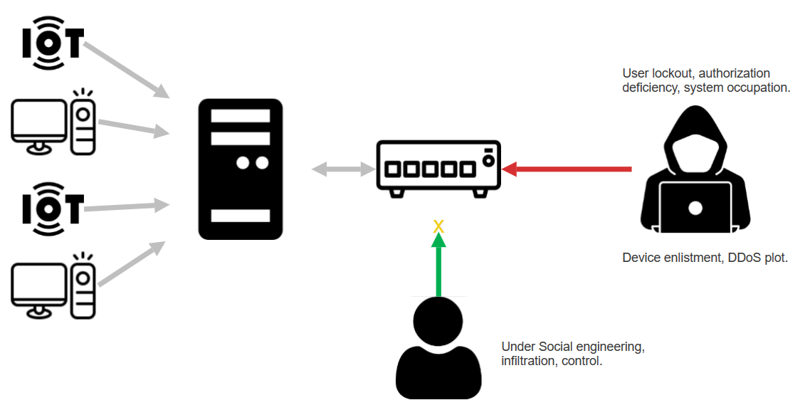
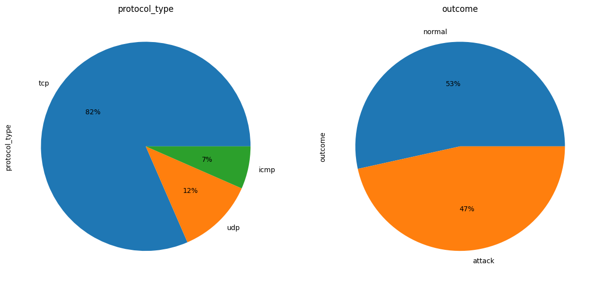
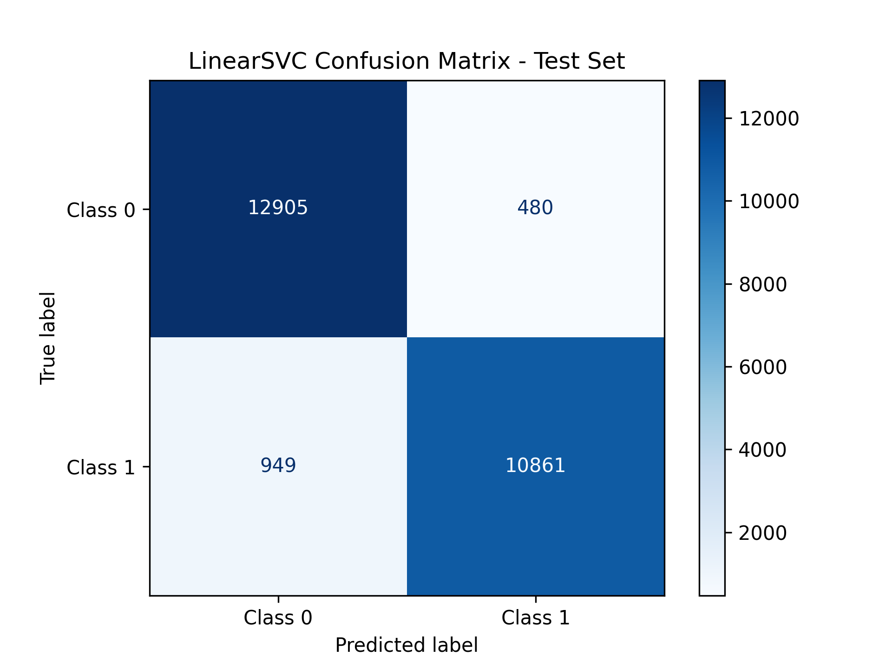
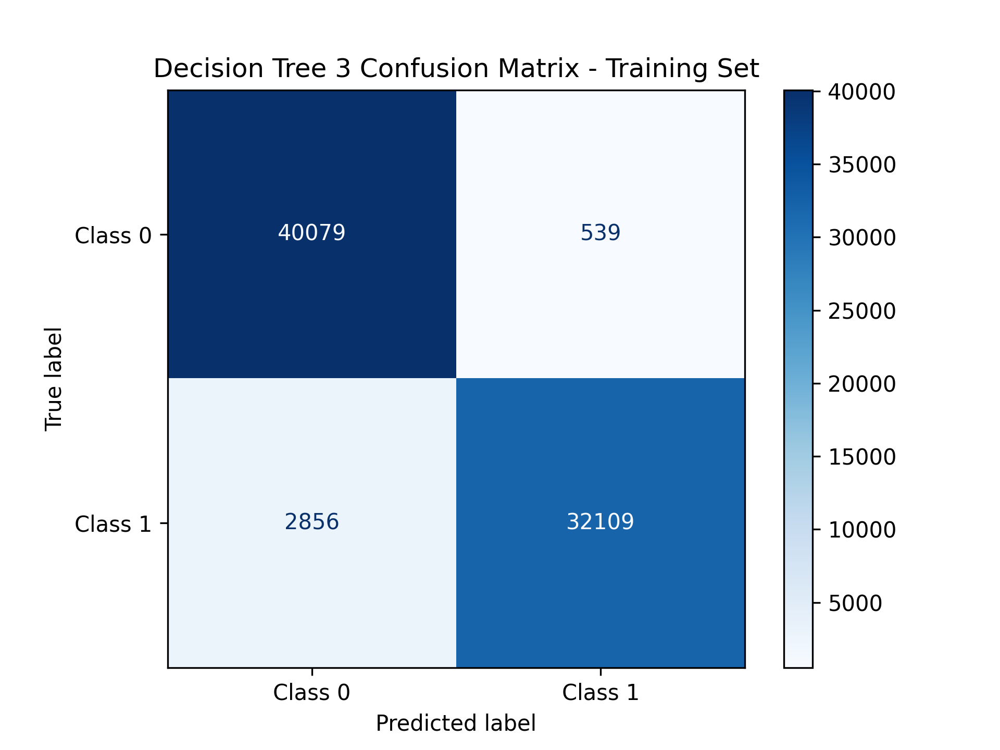
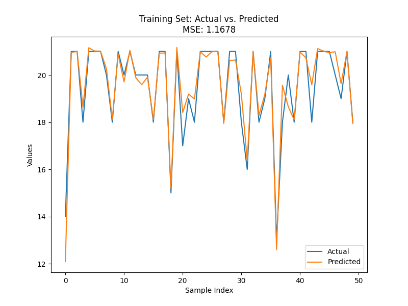
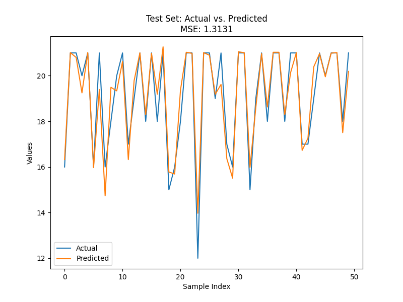
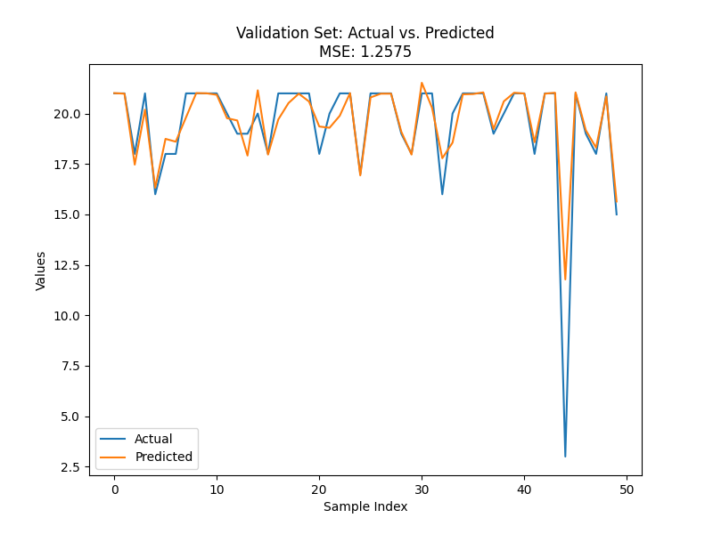

# Securing SDN Networks from BotNet Threats: A Machine Learning-Based Defense Strategy

**[Muhammad Hassan Mukhtar](https://mhm-rajpoot.github.io/breathing-resume/)**

*Student at Air University Islamabad, Pakistan*

---

## Article Info

| | |
|---|---|
| **Article history** | Written 31st December 2023 · GitHub 31st December 2023 · Available Online 1st January 2024 |
| **Keywords** | SDN · Security · Attacks · BotNet · DoS · DDoS · Research challenges · Survey |

## Abstract

With the increasing prevalence of Software-Defined Networking (SDN), there is a growing susceptibility of networks to malicious entities, particularly BotNets. This paper presents an advanced defense strategy designed to secure SDN networks against BotNet threats. Harnessing the capabilities of machine learning, our innovative approach prioritizes the proactive identification and mitigation of potential risks. By integrating intelligent algorithms, our proposed solution strengthens the network's ability to discern between normal and malicious activities, effectively thwarting BotNet recruitment attempts. The amalgamation of SDN and machine learning not only reinforces the network infrastructure but also establishes a dynamic and adaptive defense mechanism capable of evolving with emerging threats. The experimental results underscore the efficacy of our approach in significantly reducing the risk of BotNet attacks, providing a robust and resilient security framework for SDN environments. In the context of Denial of Service (DoS) and Distributed Denial of Service (DDoS) attacks, where a multitude of machines are recruited for coordinated attacks to block traffic to a specific site, our solution offers a protective measure to prevent small devices from becoming unwitting participants in such botnets.

---

## 1. Introduction

Software-Defined Networking (SDN)[[1]](#references) introduces a revolutionary paradigm by compartmentalizing network functionality into three layers. At the application layer, various network applications and services reside, interfacing with the SDN controller through defined APIs to articulate specific network behavior requirements. The SDN controller, functioning as the centralized decision-making entity in the control plane, communicates with network devices in the data plane using the OpenFlow protocol[[2]](#references). This standardized protocol enables dynamic rule establishment, modification, and deletion, empowering the controller to efficiently manage traffic flow within the network. The decoupling of the control and data planes allows for a more responsive and programmable network, fostering adaptability to evolving requirements and applications.

In the data plane, network devices such as switches and routers form the infrastructure responsible for executing forwarding decisions made by the SDN controller. These devices maintain flow tables that dictate how incoming packets should be processed, ensuring efficient packet forwarding. This separation of the data plane from the control plane enhances scalability, simplifies network management, and promotes flexibility. The SDN architecture, by leveraging the OpenFlow protocol and centralized control, not only streamlines network operations but also enables the rapid deployment of diverse applications, creating a dynamic and programmable network environment that can readily adapt to the evolving demands of modern networking.

In the control plane, we introduce a groundbreaking addition to our SDN architecture — a specialized software named **Lock**. This innovative software operates as a vigilant entity within the SDN controller, leveraging machine learning algorithms to identify and thwart potential threats associated with false internet requests, a common precursor to botnet activities. Lock actively analyzes network patterns and traffic, distinguishing between normal and malicious activities. By adopting a proactive stance, it enhances the SDN's ability to identify and mitigate risks in real-time, fortifying the network against botnet recruitment attempts.

While Lock significantly bolsters the security posture of SDN networks, it is crucial to acknowledge potential risks associated with its implementation. The false positives generated by the software may lead to legitimate requests being erroneously flagged as malicious, potentially disrupting normal network operations. Striking the right balance between robust threat detection and minimizing false positives becomes imperative to ensure the effective and smooth functioning of the network. Despite this challenge, the benefits of integrating Lock into the SDN control plane include a heightened defense mechanism against botnet attacks, providing a dynamic and adaptive shield capable of evolving with emerging threats, thus establishing a resilient security framework for SDN environments.



*Fig 1. SDN Layers [[3]](#references)*

---

## 2. Background and Related Work

### 2.1 Software Defined Networks

The SDN architecture comprises three primary components: the application plane, the control plane, and the data plane. In the application plane, SDN applications execute various functions such as enforcing security measures, implementing network policies, and running services on the SDN. These applications communicate with the control plane through the northbound interface. The control plane houses the SDN controller, which centralizes logic and maintains a global view of the network. It manages both the applications in the application plane and the OpenFlow switches in the data plane. The data plane consists of forwarding devices governed by the control plane through its southbound interface, implementing the OpenFlow protocol. These devices forward traffic flows based on specific flow rules.

The workflow of the SDN OpenFlow switch involves comparing the values of the incoming packet header with the headers in the flow table. When a match is found, the switch applies the related action specified in the flow table entry. In the absence of a match, a table-miss situation occurs, prompting the switch to forward information about the incoming packets to the controller through packet-in messages. These messages contain headers of new flows and are sent to the controller. The controller then determines the handling of the new packet by searching for a match in its table. If no match is found, the packet is dropped; otherwise, the controller communicates with the OpenFlow switch using the OpenFlow protocol and installs a new entry in the flow table. This new entry instructs the OpenFlow switch on how to handle similar future packets without consulting the controller. The basic operation of the SDN is illustrated in the workflow.

Furthermore, the working of SDN revolutionizes traditional networking by decoupling the control plane and data plane. In a conventional network, both these functions are integrated into networking devices, limiting flexibility and scalability. SDN, on the other hand, centralizes the decision-making in the control plane, allowing for more dynamic and programmable network management. This separation facilitates efficient traffic flow control, as demonstrated by the OpenFlow protocol used in SDN, enabling dynamic rule establishment, modification, and deletion. The result is a responsive and adaptable network environment that readily accommodates evolving requirements and applications, providing a streamlined and programmable approach to network operations.



*Fig 2. SDN Working [[4]](#references)*

### 2.2 BotNet Attack

Botnets utilize diverse strategies to recruit small devices, exploiting vulnerabilities and employing malicious techniques. Malware infections, exemplified by drive-by downloads and phishing attacks, infiltrate devices through injecting code on legitimate websites or tricking users into downloading malicious attachments. The exploitation of software vulnerabilities, particularly in outdated or unpatched software, affords attackers unauthorized access. Social engineering employs deceptive practices like fake software updates or disguised malicious software, targeting users' trust. Password attacks, such as brute force attempts and credential stuffing, capitalize on weak authentication measures. In the realm of the Internet of Things (IoT), insecure IoT devices, often featuring default passwords and vulnerable communication protocols, become attractive targets. The propagation of malware within local networks, facilitated by self-replicating mechanisms, contributes to the proliferation of botnets. These devices are particularly susceptible, lacking secure software to shield themselves from botnet recruitment attempts.

Mitigating these risks necessitates a comprehensive approach. Users and organizations must prioritize cybersecurity measures, encompassing regular software updates, robust password practices, and cautious handling of emails and downloads. Additionally, bolstering security measures, especially in the design and production of IoT devices, is crucial to fortifying the overall cybersecurity landscape against botnet threats.



*Fig 3. BotNet Recruiting SDN*

An infiltrator adopts the identity of an authorized user, tricking the system and seizing command of devices within the network. The objective is to enlist these devices for the execution of a Distributed Denial of Service (DDoS) attack. The legitimate user finds themselves locked out, devoid of authorization to modify system configurations, and experiences limited functionality as the system is engaged in an active attack, with resources primarily dedicated to malicious activities.

### 2.3 Related Work

To the best of our understanding, surveys in the realm of SDNs highlight the imperative for more discourse on security matters and challenges. For instance, certain authors delve into challenges linked to extensive SDNs, encompassing aspects like implementation, technology deployment, and test-bed utilization. Various studies address fault management procedures, suggesting methods for detecting, preventing, localizing, and correcting faults, along with challenges in the applied approaches. Furthermore, topics such as programming paradigms, rule placement, resource allocation, load balancing, and mathematical verification tools in SDNs are explored in distinct studies.

Upon scrutinizing literature focusing on SDN security[[5]](#references), it becomes evident that there is a requirement for more exhaustive details concerning the strategies employed to avert the involvement of small devices in botnets and their participation in DoS/DDoS attacks. The existing literature tends to generalize proposed solutions without delving into the specifics of methodologies, components, or implementation tools. In this paper, the emphasis lies specifically on thwarting the engagement of small devices in botnets and DoS/DDoS attacks, exploring associated challenges and countermeasures in-depth to enhance comprehension and facilitate the evolution of more refined approaches.

Dr. Roberto Di Pietro, 2020 also conducted its research in protecting SDN from DDoS. Numerous studies in the existing literature have investigated Distributed Denial of Service (DDoS) attacks and proposed various defense mechanisms (Tayyab et al., 2020; Snehi and Bhandari, 2021; Alamri and Thayananthan, 2020). The most widely adopted protective measures include the identification and mitigation of DDoS attacks, traffic segmentation, and the trace-back of DDoS sources. DDoS detection solutions efficiently differentiate between normal and abnormal activity streams. Traffic segmentation strategies impede significant movement, while trace-back mechanisms need to be effective, particularly in the post-attack phase. Many current DDoS detection systems face challenges such as (a) the use of legitimate requests by attackers to overwhelm the target, making it challenging to distinguish attack activity from regular traffic, and (b) the difficulty of achieving real-time detection due to the vast amount of data in contemporary networks (Suresh and Anitha, 2011).

It discusses various works centered on mitigating the involvement of small devices in such attacks, elucidating contexts and scenarios wherein these approaches can be applied. Importantly, the paper refrains from surveying challenges related to SDN layers or their design aspects, as seen in prior surveys. Furthermore, it abstains from providing an all-encompassing exploration of all threats and attacks faced by SDNs, focusing specifically on averting the inclusion of small devices in botnets and their participation in DoS/DDoS attacks within the SDN ecosystem.

---

## 3. Solution

Employing a machine learning model to assess the legitimacy of internet traffic represents a proactive strategy for enhancing cybersecurity. By training the model to differentiate between authentic and potentially malicious requests, a robust defense mechanism is established. Furthermore, the inclusion of a risk assessment feature within the model enables a nuanced comprehension of threats, empowering the system to prioritize and respond effectively. This predictive capability introduces a layer of intelligence to the security infrastructure, enhancing its adaptability to evolving cyber threats.

To further reinforce the cybersecurity architecture, the integration of the machine learning model with a Software-Defined Networking (SDN) controller is a strategic move. The SDN controller functions as a centralized hub for managing and directing network traffic. By channeling all internet traffic through this controller, a centralized point of control is established, facilitating real-time monitoring and enforcement of security policies. This integration ensures that the predictive insights from the machine learning model seamlessly influence the control of traffic flow, effectively identifying and addressing suspicious requests before they reach critical systems.

The synergy between machine learning prediction models and SDN controllers establishes a dynamic and intelligent defense system. This not only enhances the network's resilience against cyber threats but also positions the infrastructure to adapt and respond proactively to emerging security challenges. Ultimately, this integrated approach significantly elevates the overall cybersecurity posture of the organization, aligning with the assertion in [[4]](#references) that the machine learning approach outperforms other methods.

Different approaches for attack detection include statistics-based, pattern-based, rule-based, state-based, heuristic-based, and ML-based methods.

- **Statistics-based detection** involves analyzing network traffic using complex statistical techniques, requiring extensive statistical understanding, and being simple but less precise.
- **Pattern-based detection** recognizes data characteristics and patterns, being easy to implement with the use of hash functions for identification.
- **Rule-based detection** employs attack signatures, with pros including a low rate of false positives and a high rate of detection, but cons involve computational costs and the need for a large number of rules.
- **State-based detection** analyzes a series of events, being probabilistic and self-learning, leading to a low false positive rate.
- **Heuristic-based detection** identifies abnormal activity, requiring exploratory and evolutionary learning.
- **ML-based approaches** use models with rules or sophisticated transfer functions to discover data patterns or predict behaviors. The implementation of ML models varies in complexity, with pros and cons dependent on the specific characteristics of the algorithm in question.

Overall, each approach has its own strengths and weaknesses, and the choice depends on the specific requirements and characteristics of the cybersecurity environment.

### 3.1 Exploring the Dataset

The dataset comprises 125,972 samples of network traffic data, representing a combination of both normal and attack instances. Each sample is characterized by 43 columns, capturing various aspects of the network activity. The columns include features such as duration, protocol type, service, flags, and numerical attributes like source and destination bytes. Additionally, the dataset contains indicators of potential security risks, with columns like `num_compromised`, `root_shell`, and `su_attempted`. The data types for these columns vary, with integers (int64), floating-point numbers (float64), and categorical information (object). Notably, the `outcome` column specifies whether the observed network activity is a result of normal behavior or indicates an attack. Furthermore, the `level` column provides a numerical representation of the associated risk level. In summary, the dataset encapsulates a comprehensive view of network traffic, offering valuable insights into potential security threats and normal network behavior.

*Fig 4. Data Description*

```
<class 'pandas.core.frame.DataFrame'>
RangeIndex: 125972 entries, 0 to 125971
Data columns (total 43 columns):
 #   Column                       Non-Null Count   Dtype
---  ------                       --------------   -----
 0   duration                     125972 non-null  int64
 1   protocol_type                125972 non-null  object
 2   service                      125972 non-null  object
 3   flag                         125972 non-null  object
 4   src_bytes                    125972 non-null  int64
 5   dst_bytes                    125972 non-null  int64
 6   land                         125972 non-null  int64
 7   wrong_fragment               125972 non-null  int64
 8   urgent                       125972 non-null  int64
 9   hot                          125972 non-null  int64
 10  num_failed_logins            125972 non-null  int64
 11  logged_in                    125972 non-null  int64
 12  num_compromised              125972 non-null  int64
 13  root_shell                   125972 non-null  int64
 14  su_attempted                 125972 non-null  int64
 15  num_root                     125972 non-null  int64
 16  num_file_creations           125972 non-null  int64
 17  num_shells                   125972 non-null  int64
 18  num_access_files             125972 non-null  int64
 19  num_outbound_cmds            125972 non-null  int64
 20  is_host_login                125972 non-null  int64
 21  is_guest_login               125972 non-null  int64
 22  count                        125972 non-null  int64
 23  srv_count                    125972 non-null  int64
 24  serror_rate                  125972 non-null  float64
 25  srv_serror_rate              125972 non-null  float64
 26  rerror_rate                  125972 non-null  float64
 27  srv_rerror_rate              125972 non-null  float64
 28  same_srv_rate                125972 non-null  float64
 29  diff_srv_rate                125972 non-null  float64
 30  srv_diff_host_rate           125972 non-null  float64
 31  dst_host_count               125972 non-null  int64
 32  dst_host_srv_count           125972 non-null  int64
 33  dst_host_same_srv_rate       125972 non-null  float64
 34  dst_host_diff_srv_rate       125972 non-null  float64
 35  dst_host_same_src_port_rate  125972 non-null  float64
 36  dst_host_srv_diff_host_rate  125972 non-null  float64
 37  dst_host_serror_rate         125972 non-null  float64
 38  dst_host_srv_serror_rate     125972 non-null  float64
 39  dst_host_rerror_rate         125972 non-null  float64
 40  dst_host_srv_rerror_rate     125972 non-null  float64
 41  outcome                      125972 non-null  object
 42  level                        125972 non-null  int64
dtypes: float64(15), int64(24), object(4)
memory usage: 41.3+ MB
```



*Fig 4. Data Distribution (figure number as printed in the original paper)*

The dataset is well-balanced, with nearly equal representation of samples for both attack and normal behavior, totaling 125,972 entries. It encompasses a diverse range of internet protocols such as TCP, UDP, and ICMP, shedding light on various aspects of network traffic. The inclusion of almost equal instances of attack and normal behavior provides a robust foundation for analyzing and understanding potential security threats. The dataset's incorporation of different internet protocols, including TCP, UDP, and ICMP, enhances its comprehensiveness, allowing for a nuanced examination of network activities. This balanced and protocol-diverse dataset is valuable for training and evaluating models aimed at identifying and mitigating cybersecurity threats in different network environments.

### 3.2 Preprocessing Techniques

In the preprocessing steps for machine learning, label encoding is employed to transform categorical variables, specifically those of object data type, into numerical representations. This conversion allows algorithms to work effectively with categorical data, assigning a unique numeric label to each distinct category. For instance, in the provided dataset, columns such as `protocol_type`, `service`, `flag`, and `outcome` might be encoded using label encoding to convert their categorical values into numerical counterparts.

Once the label encoding is applied, the next step involves assessing the correlation between different features in the dataset. Correlation analysis helps identify relationships between variables, and columns with low correlation to the target variable or other features may be dropped to enhance model efficiency. This involves retaining only the most informative features, streamlining the dataset for more effective model training and prediction.

Subsequently, standard scaling is applied to ensure that all numerical features are on a similar scale. This step is crucial for machine learning algorithms that rely on distance-based metrics or gradient descent optimization. Standard scaling transforms the data to have a mean of 0 and a standard deviation of 1, preventing features with larger scales from dominating the learning process. By standardizing the numerical features after label encoding and potential column dropping, the dataset is prepared for input into machine learning models, optimizing their performance across diverse features and ensuring balanced contributions from each variable.

### 3.3 Train Test and Evaluate Split

The provided code segment demonstrates the crucial step of splitting the dataset into training, validation, and test sets, facilitating the robust evaluation of machine learning models. Initially, the data is divided into training and temporary sets (`x_train`, `x_temp`, `y_train`, and `y_temp`) using the `train_test_split` function, with a test size of 40% and a fixed random state for reproducibility. Subsequently, the temporary set is further partitioned into validation and test sets (`x_val`, `x_test`, `y_val`, and `y_test`) with a 50-50 split.

This process ensures that the machine learning model is trained on a substantial portion of the data, validated on a separate subset to fine-tune parameters and prevent overfitting, and ultimately tested on a completely independent set to assess generalization performance accurately.

The same procedure is then repeated for a separate regression task, involving standardized features (`standardized_filtered_x_reg`) and regression target (`yreg`). The shapes of the resulting sets are printed to verify the successful splitting of the data.

### 3.5 Modeling

> Section numbering follows the original paper, which skips 3.4.

In the context of the machine learning models employed — Support Vector Machine (SVM), Decision Tree, and XGBoost regression — the choice among them depends on the specific priorities and characteristics of the dataset. If the primary focus is on achieving strong generalization performance and robustness, especially in the presence of a higher-dimensional dataset, the Support Vector Machine (SVM) stands out as a compelling option. SVMs are known for their capability to handle complex decision boundaries, making them suitable for diverse scenarios.

When the emphasis shifts to handling complexity, generalization, and gaining insights into feature importance, the Decision Tree model and, more broadly, the Random Forest ensemble approach become valuable. The Decision Tree model offers interpretability and handles non-linear relationships well, while the Random Forest's ability to generalize effectively and provide insights into feature importance positions it as a robust candidate for network traffic classification.

Additionally, for regression tasks, XGBoost regression offers a powerful solution. XGBoost is an ensemble learning algorithm that excels in regression problems, providing high predictive accuracy through the combination of multiple weak learners. It automatically handles missing values, performs feature selection, and is known for its scalability and speed. The decision to choose XGBoost regression would depend on the specific characteristics of the regression task, dataset size, and the need for predictive accuracy.

### 3.6 Results

For the Support Vector Machine (SVM), the accuracy scores across training, validation, and test sets are consistently high, hovering around 94-95%. This suggests that the SVM model generalizes well and maintains a robust performance across different subsets of the data.

The Decision Tree models exhibit interesting trends. With a maximum depth of 3, the accuracy scores remain consistently high, indicating effective generalization. However, when the depth is not limited (no max depth), the training accuracy reaches an exceptionally high level of 99.93%. While this might suggest overfitting to the training data, the model still performs remarkably well on the validation and test sets, indicating its ability to handle complex relationships in the data. The Random Forest model, an ensemble of Decision Trees, achieves impressive accuracy across all sets, further emphasizing its ability to generalize effectively. The ensemble approach helps mitigate overfitting seen in the Decision Tree with no max depth while maintaining high accuracy.

For XGBoost Regression, the mean squared error (MSE) values provide a measure of the model's predictive performance. This suggests that the model has learned patterns in the data and is performing well in making accurate predictions.

All models exhibit strong performance, with SVM providing consistent accuracy, Decision Trees demonstrating adaptability to different depths, Random Forest showcasing ensemble strength, and XGBoost Regression demonstrating effective prediction through low MSE values. The choice of the most suitable model may depend on specific considerations such as interpretability, computational efficiency, or the nature of the task at hand.

#### Accuracy summary

| Model | Training | Test | Validation |
|---|---|---|---|
| SVM (LinearSVC) | 94.48% | 94.33% | 94.40% |
| Decision Tree (depth 3) | 95.51% | 95.50% | 95.44% |
| Decision Tree (no max depth) | 99.93% | 99.44% | 99.48% |
| Random Forest | 99.93% | 99.57% | 99.60% |

| XGBoost Regression | Training Set | Test Set | Validation Set |
|---|---|---|---|
| Mean Squared Error (MSE) | 1.1678104449135538 | 1.3131234207110196 | 1.257466355909439 |

#### Support Vector Machine (LinearSVC)

| Training Set | Test Set | Validation Set |
|---|---|---|
|  |  |  |

*SVM — Training Accuracy: 94.48% · Test Accuracy: 94.33% · Validation Accuracy: 94.40%*

#### Decision Tree (max depth 3)

| Training Set | Test Set | Validation Set |
|---|---|---|
|  |  |  |

*Decision Tree depth 3 — Training Accuracy: 95.51% · Test Accuracy: 95.50% · Validation Accuracy: 95.44%*

#### Decision Tree (no max depth)

| Training Set | Test Set | Validation Set |
|---|---|---|
|  |  |  |

*Decision Tree no depth — Training Accuracy: 99.93% · Test Accuracy: 99.44% · Validation Accuracy: 99.48%*

#### Random Forest

| Training Set | Test Set | Validation Set |
|---|---|---|
|  |  |  |

*Random Forest — Training Accuracy: 99.93% · Test Accuracy: 99.57% · Validation Accuracy: 99.60%*

> Note: in the source PDF the third Random Forest plot is titled "LinearSVC Confusion Matrix - Validation Set" and is byte-identical to the SVM validation plot above — the image appears to be mislabelled/reused in the original document.

#### XGBoost Regression — Actual vs. Predicted

| Training Set | Test Set | Validation Set |
|---|---|---|
|  |  |  |

*XGBoost Regression Mean Squared Error (MSE) — Training Set: 1.1678104449135538 · Test Set: 1.3131234207110196 · Validation Set: 1.257466355909439*

---

## 4. References

1. [Software Defined Networking: A review on Architecture, Security and Applications - IOPscience](https://iopscience.iop.org/article/10.1088/1757-899X/1099/1/012073)
2. [Model Checking the OpenFlow Protocol Using SPIN - IOPscience](https://iopscience.iop.org/article/10.1088/1755-1315/234/1/012071)
3. [Software-Defined Networking Solutions, Architecture and Controllers for the Industrial Internet of Things: A Review - PMC (nih.gov)](https://www.ncbi.nlm.nih.gov/pmc/articles/PMC8512296/)
4. [Towards a machine learning-based framework for DDOS attack detection in software-defined IoT (SD-IoT) networks - ScienceDirect](https://www.sciencedirect.com/science/article/pii/S0952197623006164)
5. [DoS and DDoS attacks in Software Defined Networks: A survey of existing solutions and research challenges - ScienceDirect](https://www.sciencedirect.com/science/article/pii/S0167739X21000911)
6. [Software-Defined Networking (SDN) Definition - Open Networking Foundation](https://opennetworking.org/sdn-definition/)
7. [ICMPv6-Based DoS and DDoS Attacks Detection Using Machine Learning Techniques, Open Challenges, and Blockchain Applicability: A Review | IEEE Journals & Magazine | IEEE Xplore](https://ieeexplore.ieee.org/document/9189788/)
8. [Vulnerability retrospection of security solutions for software-defined Cyber–Physical System against DDoS and IoT-DDoS attacks - ScienceDirect](https://www.sciencedirect.com/science/article/abs/pii/S1574013721000113)
9. [Bandwidth Control Mechanism and Extreme Gradient Boosting Algorithm for Protecting Software-Defined Networks Against DDoS Attacks | IEEE Journals & Magazine | IEEE Xplore](https://ieeexplore.ieee.org/document/9239958)
10. [Thirty Years of Machine Learning: The Road to Pareto-Optimal Wireless Networks | IEEE Journals & Magazine | IEEE Xplore](https://ieeexplore.ieee.org/document/8957702)
11. [IoT Security Techniques Based on Machine Learning: How Do IoT Devices Use AI to Enhance Security? | IEEE Journals & Magazine | IEEE Xplore](https://ieeexplore.ieee.org/document/8454402)
12. [DDoS Attack Detection Based on RLT Features | IEEE Conference Publication | IEEE Xplore](https://ieeexplore.ieee.org/document/4415434)
13. [Internet of things forensics: Recent advances, taxonomy, requirements, and open challenges - ScienceDirect](https://www.sciencedirect.com/science/article/abs/pii/S0167739X18315644)
14. [A DDoS Attack Detection and Mitigation With Software-Defined Internet of Things Framework | IEEE Journals & Magazine | IEEE Xplore](https://ieeexplore.ieee.org/document/8352645)
15. [Thirty Years of Machine Learning: The Road to Pareto-Optimal Wireless Networks | IEEE Journals & Magazine | IEEE Xplore](https://ieeexplore.ieee.org/document/8957702)
16. [A Novel Solution to Handle DDOS Attack in MANET (scirp.org)](https://www.scirp.org/journal/paperinformation?paperid=34631)
17. [A COMPREHENSIVE REVIEW ON SDN ARCHITECTURE, APPLICATIONS AND MAJOR BENEFITS OF SDN](https://www.researchgate.net/profile/Thirupathi-Vadluri-2/publication/339771419_A_COMPREHENSIVE_REVIEW_ON_SDN_ARCHITECTURE_APPLICATIONS_AND_MAJOR_BENIFITS_OF_SDN/links/5e69e18d92851c20f3220ad4/A-COMPREHENSIVE-REVIEW-ON-SDN-ARCHITECTURE-APPLICATIONS-AND-MAJOR-BENIFITS-OF-SDN.pdf)
18. [Advanced study of SDN/OpenFlow controllers | Proceedings of the 9th Central & Eastern European Software Engineering Conference in Russia (acm.org)](https://dl.acm.org/doi/abs/10.1145/2556610.2556621)
19. [Revolutionizing-Network-Control-Exploring-the-Landscape-of-Software-Defined-Networking-SDN.pdf (researchgate.net)](https://www.researchgate.net/profile/Tayyab-Muhammad-2/publication/376046656_Revolutionizing_Network_Control_Exploring_the_Landscape_of_Software-Defined_Networking_SDN/links/6568390db1398a779dc72bc1/Revolutionizing-Network-Control-Exploring-the-Landscape-of-Software-Defined-Networking-SDN.pdf)
20. [Integration of SDR and SDN for 5G | IEEE Journals & Magazine | IEEE Xplore](https://ieeexplore.ieee.org/abstract/document/6895241)
21. [Sensors | Free Full-Text | Review of Botnet Attack Detection in SDN-Enabled IoT Using Machine Learning (mdpi.com)](https://www.mdpi.com/1424-8220/22/24/9837)
22. [Symmetry | Free Full-Text | Machine Learning-Based Botnet Detection in Software-Defined Network: A Systematic Review (mdpi.com)](https://www.mdpi.com/2073-8994/13/5/866)
23. [Botnet Attack Identification Based on SDN | Cyber Security, Cryptology, and Machine Learning (acm.org)](https://dl.acm.org/doi/abs/10.1007/978-3-031-07689-3_12)
24. [An Approach to Secure Software Defined Network against Botnet Attack - IOPscience](https://iopscience.iop.org/article/10.1088/1742-6596/1362/1/012127)
